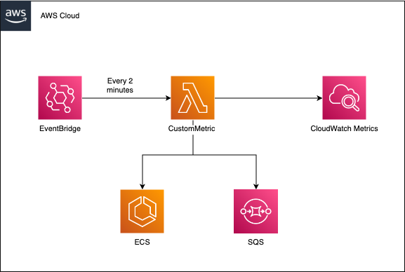

# Custom CloudWatch Metrics using AWS Lambda (.NET)
This repo contains a working, deployable solution to publish custom metrics in AWS CloudWatch. It consists of:
- CDK code to deploy:
  - Custom Metric Lambda Function
  - EventBridge to invoke the Lambda Function
  - All necessary IAM roles to read from SQS, ECS and write to CloudWatch

## Diagram

## File Structure
### CustomCloudWatchMetricStack
- `CustomCloudWatchMetricStack` contains all of the CDK code needed to deploy the stack.

### CustomMetricLambda
Below is the file structure for the CustomMetricLambda
 - Startup.cs
- CloudWatchLambda.csproj
- CustomMetricLambda.cs
- aws-lambda-tools-defaults.json
- Interfaces
  - IEntryPoint.cs
- Implementations
  - EntryPoint.cs

File structure explained:
- Startup.cs is called from CustomMetricLambda.cs initialization. It reads all environment variables and injects dependencies. The Lambda handler, which is defined in aws-lambda-tools-defaults.json, points to the FunctionHandler within CustomMetricLambda.cs.
FunctionHandler simply calls the injected implementation of IEntryPoint.cs

## Services Used
- AWS Lambda: AWS Lambda is a serverless, event-driven compute service that lets you run code for virtually any type of application or backend service without provisioning or managing servers. 
Lambda is used in this pattern to read the number of SQS messages in the queue, to read the number of running tasks within ECS, to calculate the metric value and then to publish this metric to AWS CloudWatch.
See https://aws.amazon.com/lambda/ for more information.

- EventBridge: Use Amazon EventBridge Scheduler to schedule tasks and events at scale. EventBridge is used to invoke the CustomMetricLambda every 2 minutes.
See https://aws.amazon.com/eventbridge/ for more information.

- CloudWatch: Amazon CloudWatch collects and visualizes real-time logs, metrics, and event data in automated dashboards to streamline your infrastructure and application maintenance. CloudWatch is 
where the custom metric is published. Alarms can then be set up to trigger autoscaling events.
See https://aws.amazon.com/cloudwatch/ for more information.

## Prerequisites / Assumptions
- SQS Queue already exists
- ECS service already exists
- .NET CLI Installed - https://learn.microsoft.com/en-us/dotnet/core/tools/
- CDK CLI Installed - https://docs.aws.amazon.com/cdk/v2/guide/cli.html

## Getting Started
- Ensure AWS Credentials are set. https://docs.aws.amazon.com/cli/latest/userguide/cli-configure-files.html

## Deploy to your AWS account
Running the following commands will deploy this solution to your AWS Account for the first time:
- cdk synth
- cdk bootstrap
- cdk deploy

All successive deployments only require:
- cdk deploy

## After Deploying
- The Lambda contains 3 environment variables it uses to know which SQS queue and ECS service to read from. Navigate to the AWS Console, the CustomMetricLambda function, and update the values of:
`ECS_CLUSTER_NAME`, `ECS_SERVICE_NAME`, and `QUEUE_URL` with your values.

- The Lambda will begin to be invoked every 2 minutes by EventBridge. There is no autoscaling action once this metric is published. The threshold for scaling up and down based on this metric is up to you and your service to decide. To learn more about setting scaling based on 
CloudWatch metrics, please view: https://docs.aws.amazon.com/AmazonCloudWatch/latest/monitoring/ConsoleAlarms.html

## Customize
This metric is simple to show how to publish a metric and how to utilize the AWS SDK to get metrics on certain services. It is advised to add more datapoints to this statistic so that your scaling can be done appropriately.

